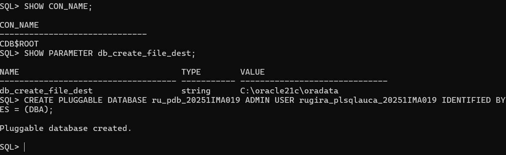
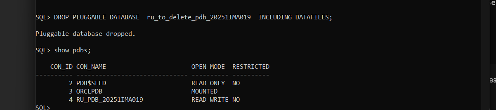
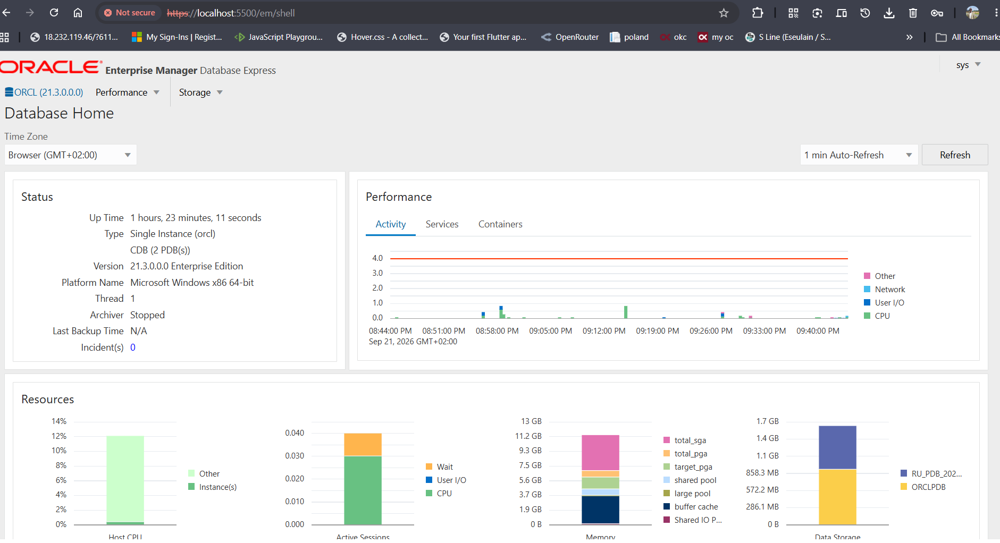

# Individual Assignment II:oracle PLuggable Database (PDB) activity

## Submission Details

*   **Repository Link:** [https://github.com/gyslain230/oracle_pdb_ass_II_20251IMA019_Rugira]
*   **PDB Name Created:** RU_PDB_20251IMA019
*   **Issues Encountered:** Yes (Resolved ORA-12514 listener resolution issue)
*   
## Overview of Tasks
This repository contains a lab report and associated artifacts for a practical exercise on multitenant architecture administration within Oracle Database 21c. The lab covers three main tasks:
1.  **Provisioning a New Pluggable Database & Local User:** Creating an independent Pluggable Database (PDB) using Oracle Managed Files (OMF), provisioning a local administrative user, and managing the database state.
2.  **Creation and Clean Deprovisioning of a Pluggable Database:** Demonstrating the safe lifecycle management of a PDB, from creation to complete removal, including the deletion of associated datafiles.
3.  **Accessing Oracle Enterprise Manager (OEM) Express:** Configuring the embedded HTTP/HTTPS listener and verifying access to the web-based OEM Database Express dashboard for performance monitoring.

## Oracle Environment Used
*   **Database Version:** Oracle Database 21c Enterprise Edition (Release 21.3.0.0.0)
*   **OS Platform:** Microsoft Windows x86 64-bit
*   **OMF Destination (`db_create_file_dest`):** `C:\oracle21c\oradata`
*   **Host / Listener Domain:** `rvslabs.io`
*   **Root Container:** `CDB$ROOT`

## Explanation of Each Task

### Task 1: Provisioning a New Pluggable Database & Local User
This task involved connecting to the root container (`CDB$ROOT`) as `SYSDBA` and issuing the `CREATE PLUGGABLE DATABASE` command. Because Oracle Managed Files (OMF) was configured (`db_create_file_dest`), the data files were automatically provisioned from `PDB$SEED`. A local administrative user (`rugira_plsqlauca_20251IMA019`) was created simultaneously and granted the `DBA` role. The PDB was then opened and its state saved to ensure it remains open across CDB restarts.

### Task 2: Creation and Clean Deprovisioning of a Pluggable Database
To demonstrate lifecycle management, a temporary PDB (`ru_to_delete_pdb_20251IMA019`) was created. Before dropping a PDB, it must be closed to release operating system locks on the data files. The PDB was closed using `ALTER PLUGGABLE DATABASE ... CLOSE IMMEDIATE`, and then permanently removed using the `DROP PLUGGABLE DATABASE ... INCLUDING DATAFILES` command, ensuring no orphaned files were left on the disk.

### Task 3: Accessing Oracle Enterprise Manager (OEM) Express
This task verified the configuration of OEM Database Express. The `DBMS_XDB_CONFIG.SETHTTPSPORT` package was used to set the HTTPS port to 5500. After registering the changes, the web dashboard was accessed at `https://localhost:5500/em/shell`. The dashboard successfully displayed real-time metrics for the instance and tracked the newly created PDBs.

## Challenges Faced and Solutions
*   **Challenge (Task 1):** Encountered `ORA-12514: TNS:listener does not currently know of service requested in connect descriptor` when attempting to connect to the new PDB via SQL*Plus.
*   **Solution:** By checking the listener status (`lsnrctl status`), it was discovered that the listener registered the PDB service with a domain suffix (`.rvslabs.io`). The connection was successfully established by updating the connection string to use the fully-qualified service name (`ru_pdb_20251ima019.rvslabs.io`) or by bypassing the listener and using `ALTER SESSION SET CONTAINER`.

## Integrity Statement
I certify that the work submitted in this lab report and repository is my own. I have completed the tasks outlined, and any challenges faced were resolved using documented Oracle procedures and independent troubleshooting.

---
